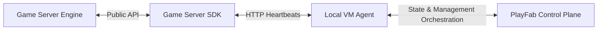

This document provides a high-level overview of the PlayFab Game Server SDK (GSDK) architecture. It describes how the SDK integrates with the PlayFab Multiplayer Servers (MPS) platform, the environment variables provided by the virtual machine (VM) host, the configuration file, and the core communication model.

## System Integration Overview

The GSDK is a lightweight client-side library integrated directly into a game server executable. It serves as the bridge between the game server and the **Local VM Agent** running on the host virtual machine. The VM Agent communicates with the PlayFab Multiplayer Servers control plane to manage allocation, health, and server lifecycle.

## Environment Variables

The host virtual machine or container environment injects several environment variables into the game server process. The GSDK relies on these variables for configuration, identification, and bootstrapping:

*   **`GSDK_CONFIG_FILE`**: The absolute path to a JSON configuration file generated on the host VM. This file provides critical endpoints and instance details required for communication with the VM Agent.
*   **`PF_TITLE_ID`**: The unique PlayFab title identifier associated with the game.
*   **`PF_BUILD_ID`**: The specific PlayFab build identifier representing the active deployment of the multiplayer server.
*   **`PF_REGION`**: The cloud region (e.g., `EastUS`, `WestEurope`) in which the virtual machine is running.

## Local Configuration File

The JSON configuration file specified by the `GSDK_CONFIG_FILE` environment variable contains the operational details of the server environment. Key information included in this file covers:

*   **Heartbeat Endpoint (`heartbeatEndpoint`)**: The local IP and port where the VM Agent is listening.
*   **Session Host ID (`sessionHostId`)**: A unique identifier representing the specific game server process instance.
*   **Folders and Directories**: Configuration paths for logging (`logFolder`), shared content (`sharedContentFolder`), and local certificates (`certificateFolder`).
*   **Network Port Mappings (`gamePorts` & `gameServerConnectionInfo`)**: Maps local listening ports to external public ports for client connections.
*   **Host Identifiers**: The host virtual machine ID (`vmId`), public IPv4 address (`publicIpV4Address`), and fully qualified domain name (`fullyQualifiedDomainName`).

## State Machine and Operations

The SDK maintains an internal state machine representing the game server's lifecycle:

*   **`Initializing`**: Assets and resources are loading.
*   **`StandingBy`**: Loaded and idling, waiting for players.
*   **`Active`**: Allocated for a session, serving players.
*   **`Terminating`**: Initiating shutdown protocols.

The VM Agent drives state transitions using response commands (`Continue`, `Active`, `Terminate`) in response to periodic GSDK heartbeats.

## Network Communication & Control Loop

All communications are HTTP-based and executed locally within the VM between the GSDK and the VM Agent:

*   **Handshake**: On startup, the SDK sends a POST request with GSDK metadata (language/flavor and version) to the VM Agent endpoint.
*   **Heartbeat Loop**: The SDK establishes a background loop that sends periodic PATCH requests to the VM Agent. The request carries the current state, game health, and connected player list. The response dictates the next required action (e.g., transition to `Active` or `Terminate`).
*   **Synchronization**: When the game is ready, a blocking call transitions the state to `StandingBy` and pauses the main execution thread. Upon receiving an `Active` operation command in the heartbeat response, the background thread unblocks the main thread to allow client connections.
