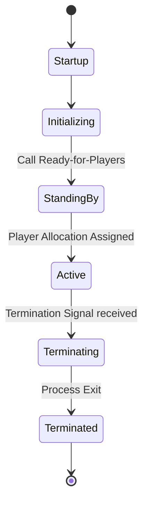
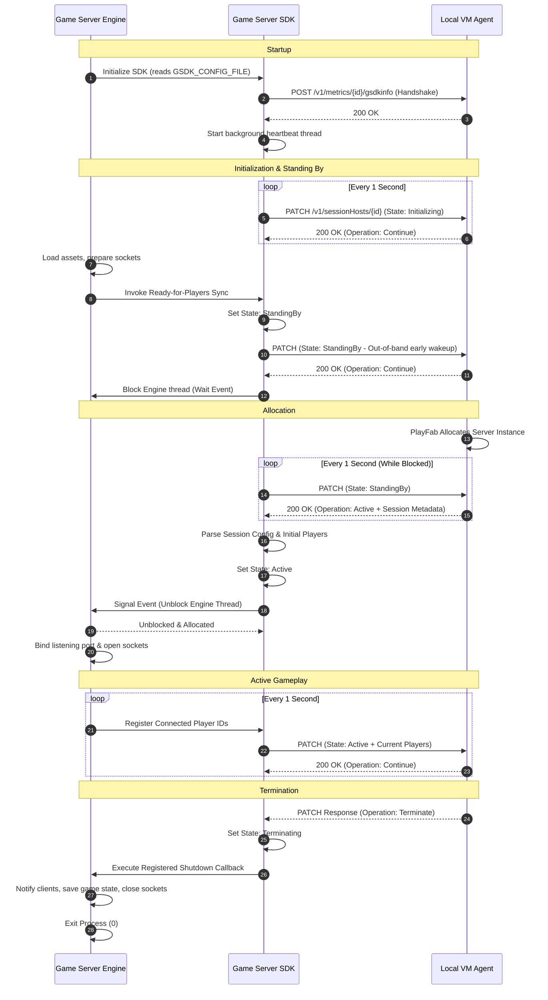

This document describes the complete lifecycle of a multiplayer game server managed by PlayFab Multiplayer Servers (MPS) and integrated with the Game Server SDK (GSDK).

---

## High-Level Lifecycle Phases

The game server process progresses through five major lifecycle phases, coordinated in real-time with the local VM Agent via GSDK heartbeats.

---

## Process Flow

### Startup & Bootstrapping
When the PlayFab Multiplayer Servers control plane provisions or scales up a game server instance, it spins up the container or launches the executable process on the host VM.
1.  **Environment Variable Injection**: The OS injects critical parameters into the process space, including the config file pointer (`GSDK_CONFIG_FILE`), title ID (`PF_TITLE_ID`), build ID (`PF_BUILD_ID`), and region (`PF_REGION`).
2.  **SDK Parsing**: The game engine starts and initializes the GSDK. The SDK reads the local JSON configuration file to resolve the VM Agent endpoint address and its unique session host instance ID.
3.  **Local Logging**: The GSDK creates a timestamped output file in the specified log folder and prepares the file stream for writing logs.

### Game Initialization
The game server transitions to the `Initializing` state.
1.  **Asset Loading**: The game engine compiles shaders, loads map geometry, initializes physics grids, and configures internal networking sockets.
2.  **SDK Handshake**: The GSDK sends an initial HTTP POST containing SDK metadata (its language flavor and compiler version) to the VM Agent.
3.  **Loop Startup**: The GSDK starts its background heartbeat thread, sending periodic PATCH requests to the VM Agent to signal that it is currently alive and initializing.
4.  **Ready Signal**: Once the game engine finishes loading all required startup resources, it invokes the Ready-for-Players synchronizer.

### Standing By (Idle)
The game server transitions to the `StandingBy` state and waits for players.
1.  **State Promotion**: The GSDK updates its state to `StandingBy` and immediately triggers an early out-of-band heartbeat to report this state change to the VM Agent.
2.  **Execution Pause**: The GSDK blocks the main thread of the game engine using an OS-level synchronization lock.
3.  **Idle Monitoring**: The game engine remains idle. The background heartbeat thread continues to ping the VM Agent every second with a `StandingBy` state, confirming the server is ready to accept a match allocation.

### Allocation & Active Play
When players request a game session (typically via PlayFab Matchmaking), the control plane allocates the standing-by server.
1.  **Allocation Command**: The VM Agent returns an `Active` operation command in its next heartbeat response. The payload includes a session configuration block containing the allocated session ID, session cookie, custom metadata, and a list of authorized player IDs.
2.  **Unblocking**: The GSDK updates its internal configuration map with the allocation metadata and transitions the state to `Active`. It signals the synchronization primitive, unblocking the game server's main thread.
3.  **Socket Bind**: The game engine wakes up, parses the port mapping and assigned players, binds to the server listening port, and opens socket connections to begin receiving clients.
4.  **Player Tracking**: As players connect and disconnect, the game engine registers these updates via the GSDK. The GSDK reports the active player IDs to the VM Agent in subsequent heartbeat payloads.

### Graceful Termination
When the match is completed, or if the host VM needs to be scaled down or rebooted, the server is shut down.
1.  **Termination Command**: The VM Agent returns a `Terminate` operation command in a heartbeat response.
2.  **Callback Invocation**: The GSDK transitions the internal state to `Terminating` and executes the developer's registered shutdown callback.
3.  **Cleanup**: The game engine stops accepting new connections, saves outstanding player progress or match metrics, notifies connected clients, and gracefully disconnects them.
4.  **Process Exit**: The game engine terminates its process cleanly. The GSDK logs the final state change, and the VM Agent cleans up the container/process.

---

## Real-Time Interaction Sequence

The following sequence diagram outlines the chronological interaction between the Game Server Engine, the internal GSDK, and the Local VM Agent during a standard lifecycle.

